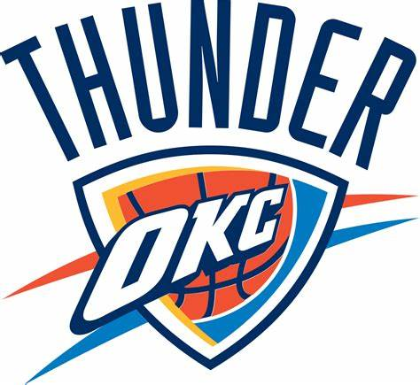

Drużyny NBA
======================

Oklahoma City Thunder
----------------------

Opis
Oklahoma City Thunder zespół NBA powstały z przeniesienia zespołu Seattle SuperSonics do Oklahomy w 2008 roku.

Jeszcze jako SuperSonics, zespół zakwalifikował się do playoffów 22 razy, sześć razy wygrali swoją dywizję oraz raz wygrali mistrzostwo NBA w 1979. 
Od czasów przenosin do Oklahomy, do playoffów zakwalifikowali trzy razy (2010–2012), dwukrotnie wygrali dywizję (sezony 2010/2011, 2011/2012). 
Największym dotychczasowym sukcesem Thunder było dojście do finału NBA, gdzie jednak przegrali z Miami Heat 4–1[1].

   Oklahoma City Thunder

