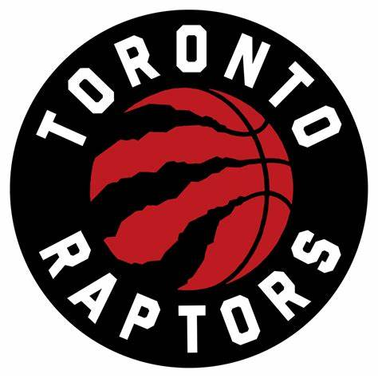

Drużyny NBA
==================

Toronto Raptors
------------------

Opis
Kanadyjski klub koszykarski uczestniczący w rozgrywkach ligi NBA, mistrzowie z 2019. 
Domowe mecze rozgrywają w hali Scotiabank Arena położonej w Toronto, będąc jedyną organizacją ligi z siedzibą poza terytorium Stanów Zjednoczonych. 
W sezonie 2020/21 swoje spotkania domowe rozgrywali w Amalie Arena w mieście Tampa na terenie Stanów Zjednoczonych z powodu restrykcji spowodowanych pandemią koronawirusa w Kanadzie.

   Toronto Raptors
